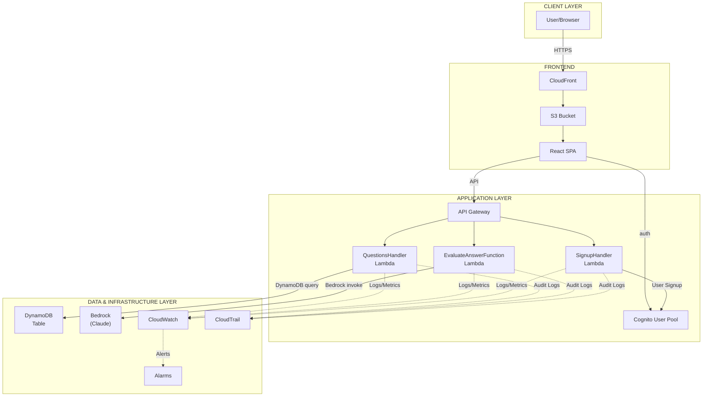

# SkillScout System Architecture

## Architecture Diagram

## Components

### Client Layer
- **User/Browser** - End users and admins

### Frontend
- **CloudFront** - CDN for content delivery
- **S3 Bucket** - Static hosting for React app
- **React SPA** - TypeScript application (React 19 + Vite)

### Application Layer
- **API Gateway** - REST API with Cognito authorizer
- **Cognito User Pool** - Authentication + Admin groups
- **QuestionsHandler Lambda** - CRUD operations (Python 3.11)
- **EvaluateAnswerFunction Lambda** - AI evaluation (Python 3.11)
- **SignupHandler Lambda** - User registration (Python 3.11)

### Data & Infrastructure
- **DynamoDB Table** - InterviewQuestions storage
- **Bedrock (Claude)** - AI answer evaluation
- **CloudWatch** - Logs, metrics, dashboard
- **Alarms** - 8 total (4 AWS + 4 custom)
- **CloudTrail** - Audit logging

---

*Last Updated: 2026-02-23*
