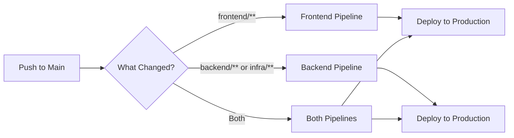
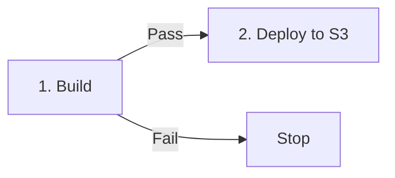
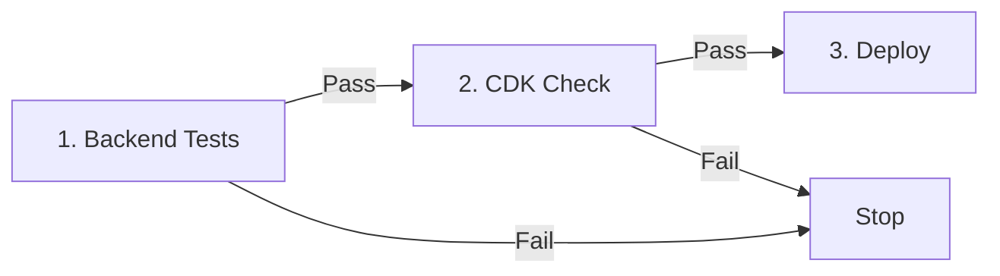
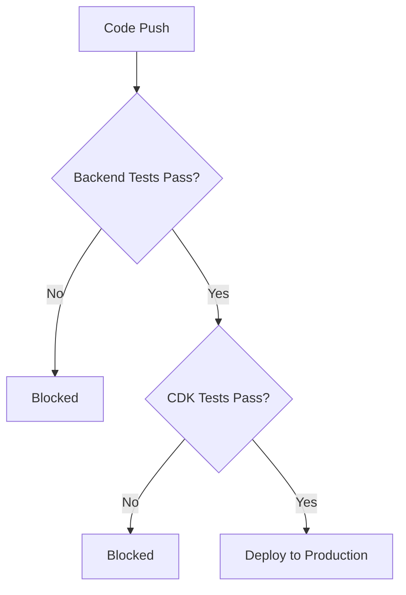

# SkillScout CI/CD Pipeline
Visual guide to our deployment pipelines.

---

## Quick Overview
We have **2 independent pipelines** that run in parallel:

---

## Frontend Pipeline
**2-step process:**

### Stage Details
| Stage | What Happens | Duration |
|-------|-------------|----------|
| **1. Build** | npm install npm run build (TypeScript + Vite) | ~2 min |
| **2. Deploy** | Get S3 bucket from CloudFormation Upload to S3 | ~1 min |

**Total Time:** ~3 minutes

---

## Backend & Infrastructure Pipeline
**3-step process:**

### Stage Details
| Stage | What Happens | Duration |
|-------|-------------|----------|
| **1. Backend Tests** | make build (black formatter) make lint (flake8) pytest -v (40 unit tests) | ~3 min |
| **2. CDK Check** | npm run build (TypeScript) npm test (Jest 13 CDK tests) | ~2 min |
| **3. Deploy** | npm run cdk deploy Update Lambda, API Gateway, DynamoDB, CloudWatch Alarms, Dashboard | ~4 min |

**Total Time:** ~9 minutes

---

## Environment
| Environment | AWS Account | Region |
|-------------|-------------|--------|
| **Production** | 315833389186 | eu-west-1 |

---

## Security & Quality Gates

### What Blocks Deployment?

### Security Checks (Every Build)
- **Code Quality** - black formatter, flake8, ESLint, TypeScript
- **Unit Tests** - Backend pytest suite (40 tests)
- **Infrastructure Tests** - CDK Jest tests (13 tests)

---

## Pipeline Triggers
| Files Changed | Pipeline Triggered |
|---------------|-------------------|
| `frontend/**` | Frontend only |
| `backend/**` | Backend only |
| `infrastructure/**` | Backend only |
| `package.json` | Both |
| `.github/workflows/**` | Both |

---

## Related Documentation
- [README](../README.md) - Project overview
- [User Stories](USER_STORIES.md) - Feature requirements
- [Architecture Diagram](ARCHITECTURE.md) - System architecture
- [GitHub Actions Workflows](../.github/workflows/) - Pipeline source code

---

*Last Updated: 2026-02-23*
