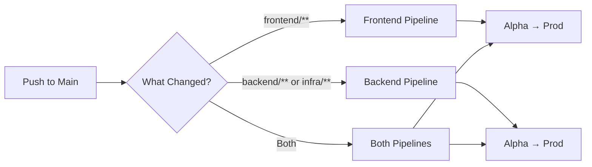
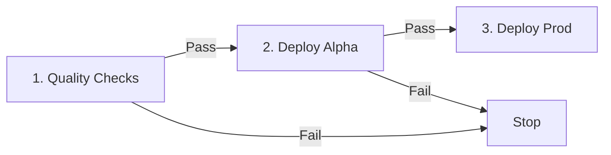
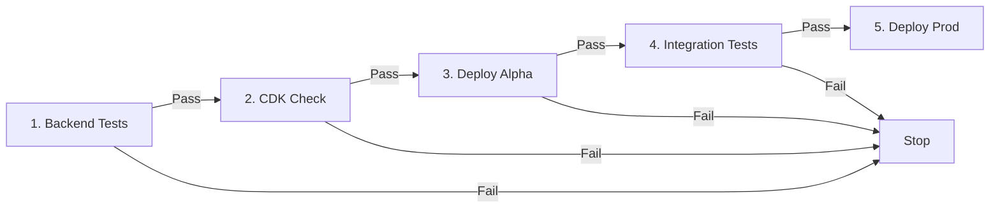
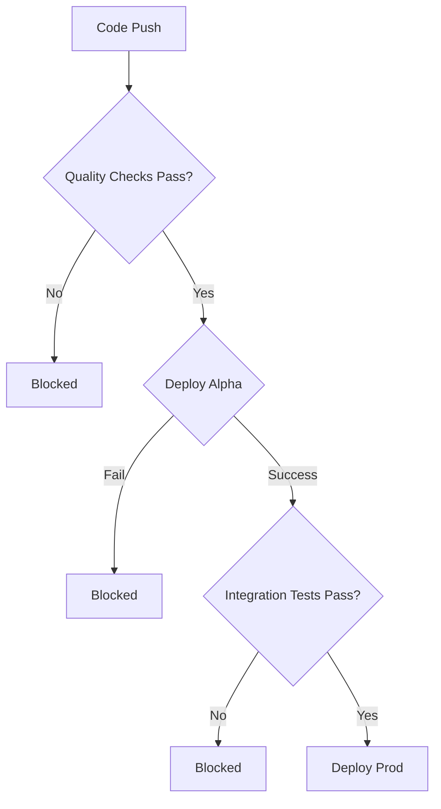

# SkillScout CI/CD Pipeline
Visual guide to our deployment pipelines.

---

## Quick Overview
We have **2 independent pipelines** that both deploy to Alpha then Prod:

---

## Frontend Pipeline
**4-stage process:**

### Stage Details
| Stage | What Happens | Duration |
|-------|-------------|----------|
| **1. Quality Checks** | ESLint TypeScript type check Trivy security scan | ~2 min |
| **2. Deploy Alpha** | Build with Alpha config Upload to Alpha S3 Invalidate CloudFront | ~2 min |
| **3. Deploy Prod** | Build with Prod config Upload to Prod S3 Invalidate CloudFront | ~2 min |

**Total Time:** ~6 minutes

---

## Backend & Infrastructure Pipeline
**5-stage process:**

### Stage Details
| Stage | What Happens | Duration |
|-------|-------------|----------|
| **1. Backend Tests** | make build (black + flake8) pytest -v (40 unit tests) Trivy security scan | ~3 min |
| **2. CDK Check** | npm test (Jest 13 CDK tests) TypeScript type check CDK synth | ~2 min |
| **3. Deploy Alpha** | CDK deploy to Alpha AWS account Update Lambda, API Gateway, DynamoDB | ~4 min |
| **4. Integration Tests** | pytest integration tests against Alpha | ~1 min |
| **5. Deploy Prod** | CDK deploy to Prod AWS account Update Lambda, API Gateway, DynamoDB | ~4 min |

**Total Time:** ~14 minutes

---

## Environments
| Environment | AWS Account | Region |
|-------------|-------------|--------|
| **Alpha** | 969831126809 | eu-west-1 |
| **Production** | 315833389186 | eu-west-1 |

---

## Security & Quality Gates

### What Blocks Deployment?

### Security Checks (Every Build)
- **Code Quality** - black formatter, flake8, ESLint, TypeScript
- **Unit Tests** - Backend pytest suite (40 tests), CDK Jest (13 tests)
- **Security Scanning** - Trivy vulnerability scanner (CRITICAL/HIGH severity)
- **Integration Tests** - Live tests against Alpha environment

---

## Pipeline Triggers
| Files Changed | Pipeline Triggered |
|---------------|-------------------|
| `frontend/**` | Frontend only |
| `backend/**` | Backend only |
| `infrastructure/**` | Backend only |
| `package.json` | Both |
| `.github/workflows/**` | Both |

---

## Related Documentation
- [README](../README.md) - Project overview
- [User Stories](USER_STORIES.md) - Feature requirements
- [Architecture Diagram](ARCHITECTURE.md) - System architecture
- [GitHub Actions Workflows](../.github/workflows/) - Pipeline source code

---

*Last Updated: 2026-02-23*
